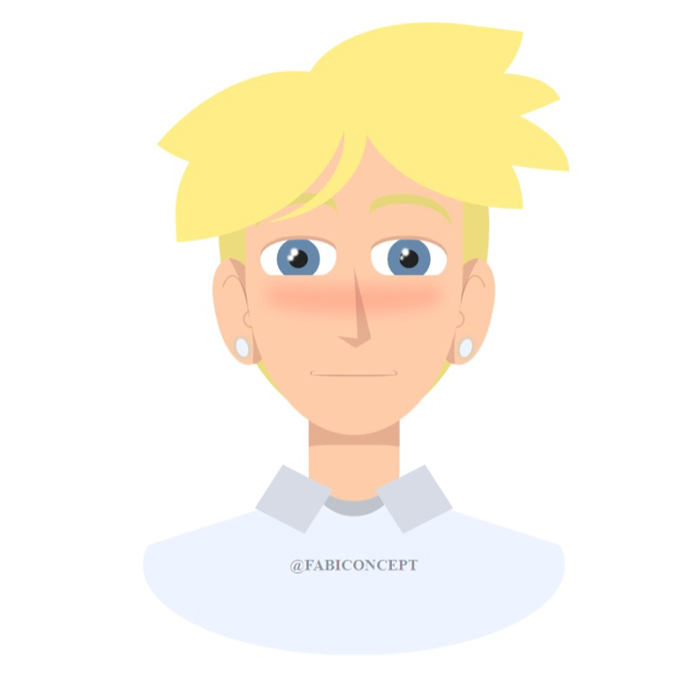
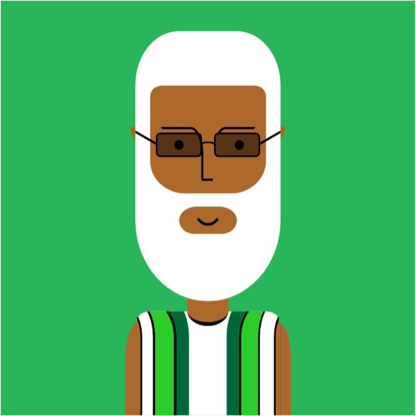
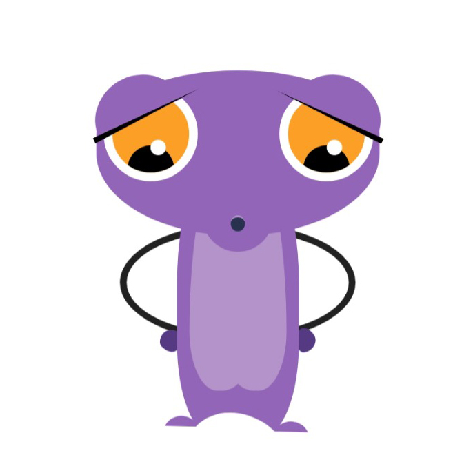
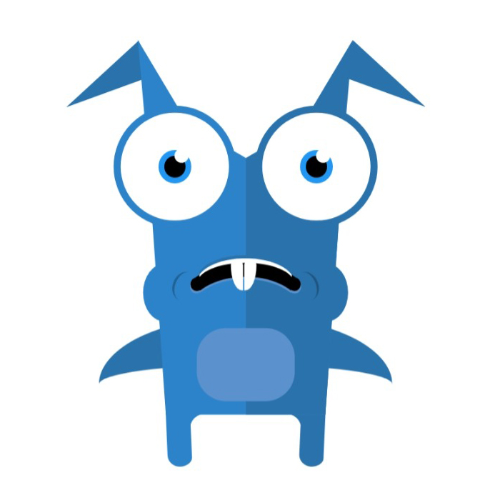
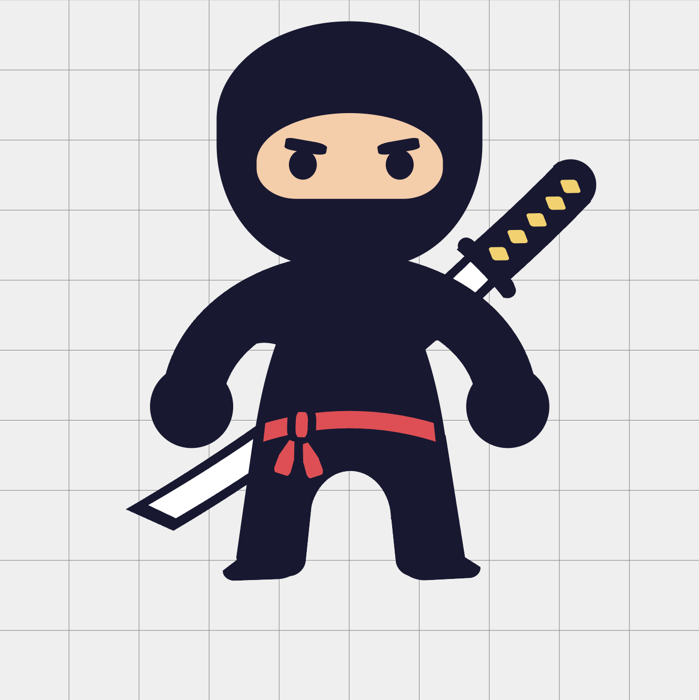

## HTML & CSS Drawings

Hello and welcome to my repository of drawings made entirely with HTML & CSS! I created this repo as a fun way to express my creativity and explore the possibilities of web development.

### Sneak Peak

### About the Drawings
All of the drawings in this repository were created using only HTML & CSS. While some of these drawings are based on reference photos, each one is a unique piece of art that I created during my free time. I'm excited to share them with you, and I hope they bring you as much joy as they bring me!

I want to give a big shout out to @Avaro Montoro for inspiring me to create these HTML & CSS drawings. Your work has been a huge inspiration to me, and I am grateful for the knowledge and creativity that you have shared with the community. Thank you!

### Contributing
I would love to see other people's creations and techniques, or even some new drawings that I haven't thought of yet. If you have an idea for a new drawing or would like to contribute to an existing one, please don't hesitate to submit a pull request.

### Contact
If you have any questions, comments, or just want to say hi, feel free to reach out to me at [favourajokubi@gmail.com](mailto:favourajokubi@gmail.com). I'm always happy to chat with fellow web developers. Thank you for taking the time to check out my repository, and happy coding!
